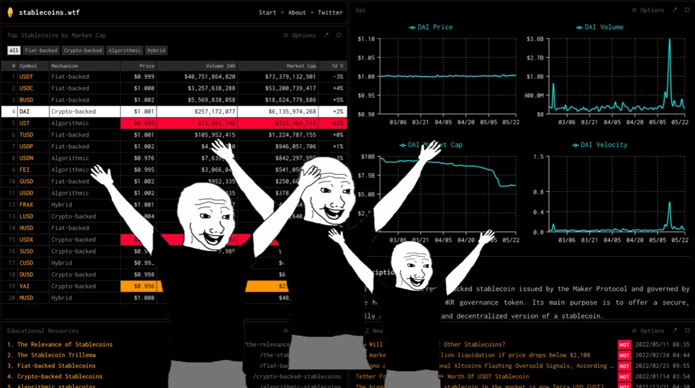

# stablecoins.wtf

Follow us on [Twitter](https://twitter.com/stablecoinswtf), anon.



## Getting Started

```bash
# Install pnpm
npm i -g pnpm

# Install dependencies
pnpm install

# Copy & fill environments
cp packages/frontend/.env.local.example packages/frontend/.env.local
```

## Development

I reommend developing in VSCode by opening the workspace file located at `.vscode/*.code-workspace` and installing recommended plugins listed in `.vscode/extensions.json`.

```bash
# Start development (frontend)
pnpm dev
```

